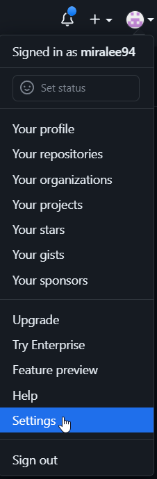
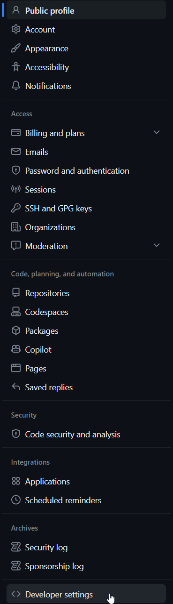
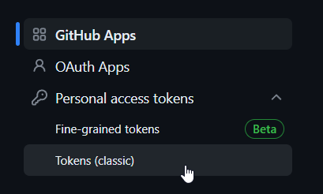

# Description

This is a Python script that creates a repository in Github profile using token. Script may recieve three arguments:
- the repo name
- team name to be set as a issue label
- color of the label

# Usage
Download container

```
docker pull ghcr.io/miralee94/create_repo:latest
```
After pulling the image, run the container to create a repo with a custom issue label. Replace ```<repo>``` with the name you want to give to your new repository and ```<label>``` with a team name. You can also choose the color of the label; otherwise, the default is set to pink.

Only repo argument is mandatory
```
docker run -v C:\my\path\config.txt:/app/config.txt ghcr.io/miralee94/create_repo:latest <repo> --label <label> --color <red/blue/green/black/white>
```


# Prerequisites
- Docker
- GitHub token in config.txt

Go to settings



Developer settings



Personal access token, Token (classic)



Generate new token and add token to config.txt

